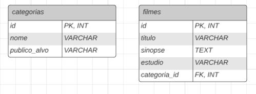

# Exercícios Banco de dados

# Etapa 1

Arquivo txt nomeado como "etapa1Animais.txt"

Este projeto consiste em um banco de dados MySQL que armazena informações sobre animais e suas espécies. 
O banco de dados inclui tabelas para as espécies e os animais, bem como consultas de exemplo.

# Etapa 2 

Arquivo txt nomeado como "etapa2Tabelas.txt", exercícios estão divididos com comentários no arquivo

Ex1:

Neste exercício, criamos um banco de dados para armazenar informações sobre animais e suas espécies. A tabela `especies` armazena informações sobre as espécies, enquanto a tabela `animais` relaciona os animais às suas respectivas espécies. Foram inseridos dados de exemplo para três espécies e oito animais.

Ex2: 

Neste exercício, criamos um banco de dados para registrar informações sobre produtos e suas marcas. A tabela `marcas` contém detalhes sobre as marcas, enquanto a tabela `produtos` relaciona os produtos às suas marcas. Inserimos dados de exemplo para três marcas e oito produtos.

Ex3: 

Neste exercício, criamos um banco de dados para registrar informações sobre filmes e suas categorias. A tabela `categorias` contém informações sobre as categorias dos filmes, enquanto a tabela `filmes` relaciona os filmes às suas respectivas categorias. Inserimos dados de exemplo para três categorias e oito filmes.

